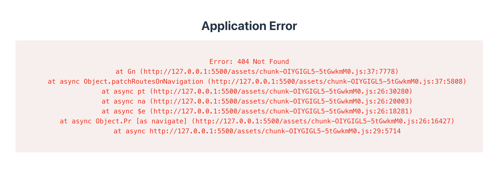

#Rakenduse muutmine staatiliseks.

**NB! Et rajad ehitataks erinevates serverites õigesti näitama, võib vajalik olla `ssr:false`** 


`react-router.config.ts` seadistame rajad. 
```ts
import type { Config } from "@react-router/dev/config";

export default {
  appDirectory: "src",
  ssr: true,
  async prerender() {
    return["/", "/users", "/users/1", "/users/2", "/users/3"]
  }
} satisfies Config;
```

Et urlid oleks leitavad suhtelisel rajal, tuleks `root.tsx`failis muuta css impordi viisi:
```tsx
import {
  Links,
  Meta,
  Outlet,
  Scripts,
  ScrollRestoration,
} from "react-router";

import type { Route } from "./+types/root";
// Regular import for development
// import "./app.css";  

// For usual stuff, import as usual `import "./styles/index.css"
// For static builds, import with ?url suffix if needed
import appStyles from "./styles/index.css?url";

export const links: Route.LinksFunction = () => [
  { rel: "preconnect", href: "https://fonts.googleapis.com" },
  {
    rel: "preconnect", 
    href: "https://fonts.gstatic.com",
    crossOrigin: "anonymous",
  },
  {
    rel: "stylesheet",
    href: "https://fonts.googleapis.com/css2?family=Inter:ital,opsz,wght@0,14..32,100..900;1,14..32,100..900&display=swap",
  },
  // Add your CSS files here if using ?url imports:
  { rel: "stylesheet", href: appStyles },
];
```

**NB! Kontrollime, et oleks õiged skriptid**
```json
"scripts": {
    "dev": "react-router dev",
    "build": "react-router build",
    "start": "react-router-serve ./build/server/index.js",
    "typecheck": "react-router typegen && tsc"
  }
```
**NB! Et serve käsklus töötaks** tuleb installida `npm install @react-router/serve`

Kui endiselt esineb Manifesti ja linkide leidmise probleeme, võib nimetada src folderi ümber app folderiks, kuna react router ksutab sellist nimetamist.

##Docker deploy

Eeldab `Dockerfile` olemasolu:

```Dockerfile
FROM node:20-alpine AS development-dependencies-env
COPY . /app
WORKDIR /app
RUN npm ci

FROM node:20-alpine AS production-dependencies-env
COPY ./package.json package-lock.json /app/
WORKDIR /app
RUN npm ci --omit=dev

FROM node:20-alpine AS build-env
COPY . /app/
COPY --from=development-dependencies-env /app/node_modules /app/node_modules
WORKDIR /app
RUN npm run build

FROM node:20-alpine
COPY ./package.json package-lock.json /app/
COPY --from=production-dependencies-env /app/node_modules /app/node_modules
COPY --from=build-env /app/build /app/build
WORKDIR /app
CMD ["npm", "run", "start"]
```
Loo ka `.dockerignore` fail
```
.react-router
build
node_modules
README.md
```


```bash
docker build -t my-app .

# Run the container
docker run -p 3000:3000 my-app
```

## GitHub Pages Deploy

### 1. GitHub Actions Workflow faili loomine

Loo fail `.github/workflows/static.yml` järgmise sisuga (muudatused võrreldes vaikimisi GitHub Pages workflow-ga):

```yaml
# Lihtne workflow staatilise sisu deployimiseks GitHub Pages-i
name: Deployi staatiline sisu Pages-i

on:
  # Käivitatakse main branchi push-idel
  push:
    branches: ["main"]

  # Võimaldab käivitada workflow käsitsi Actions sakilt
  workflow_dispatch:

# Seadistab GITHUB_TOKEN õigused GitHub Pages deployimiseks
permissions:
  contents: read
  pages: write
  id-token: write

# Lubab ainult ühe paralleelse deployimise korraga
# Ei tühista pooleliolevaid deploye, et tootmisdeployid saaksid lõpuni toimida
concurrency:
  group: "pages"
  cancel-in-progress: false

jobs:
  # Üks deploy töö, kuna me lihtsalt deployime
  deploy:
    environment:
      name: github-pages
      url: ${{ steps.deployment.outputs.page_url }}
    runs-on: ubuntu-latest
    steps:
      - name: Kood alla
        uses: actions/checkout@v4
      - name: Seadista Node.js
        uses: actions/setup-node@v4
        with:
          node-version: '20'
          cache: 'npm'
      - name: Installi sõltuvused
        run: npm ci
      - name: Ehita GitHub Pages jaoks
        run: npm run build:gh
      - name: Seadista Pages
        uses: actions/configure-pages@v5
      - name: Laadi üles artefakt
        uses: actions/upload-pages-artifact@v3
        with:
          # Laadi üles build/client kaust
          path: './build/client'
      - name: Deployi GitHub Pages-i
        id: deployment
        uses: actions/deploy-pages@v4
```

**Peamised muudatused võrreldes vaikimisi static.yml failiga:**

🔄 **LISATUD:**
- `Seadista Node.js` samm Node.js 20 ja npm cache-iga
- `Installi sõltuvused` - `npm ci` käsk
- `Ehita GitHub Pages jaoks` - kasutab `npm run build:gh` asemel tavalist build käsku

🔄 **MUUDETUD:**
- `Laadi üles artefakt` samm kasutab `./build/client` teed asemel `.` (kogu repositooriumi)

❌ **EEMALDATUD vaikimisi workflow-st:**
- Tavaline staatiline workflow ei sisalda Node.js ehitamise samme

### 2. GitHub Pages seadistamine

1. Mine oma GitHub repositooriumi **Settings > Pages**
2. Vali **Source: "GitHub Actions"**
3. Workflow on nüüd seadistatud ja deployib automaatselt main branchi pushidel

## Konfiguratsiooni failide muudatused

### react-router.config.ts

```typescript
import type { Config } from "@react-router/dev/config";

export default {
  appDirectory: "src",
  ssr: process.env.SSR !== "false",
  basename: process.env.GITHUB_PAGES ? "/testdeploy" : "/",
  async prerender() {
    return["/", "/users", "/users/1", "/users/2", "/users/3"]
  }
} satisfies Config;
```

**Selgitused:**
- `ssr: process.env.SSR !== "false"` - SSR on vaikimisi sees, välja lülitatud kui `SSR=false`
- `basename: process.env.GITHUB_PAGES ? "/testdeploy" : "/"` - Kasutab `/testdeploy` GitHub Pages jaoks, `/` lokaalses arenduses

### vite.config.ts

```typescript
import { defineConfig } from "vite";
import { reactRouter } from "@react-router/dev/vite";

export default defineConfig({
  plugins: [reactRouter()],
  // Kasuta base ainult GitHub Pages jaoks, mitte lokaalseks arenduseks
  base: process.env.GITHUB_PAGES ? "/testdeploy/" : "/",
});
```

**Selgitused:**
- `base` määrab kõigi assettide (CSS, JS failid) prefiksi
- GitHub Pages jaoks `/testdeploy/`, lokaalses arenduses `/`

### package.json scripts

```json
{
  "scripts": {
    "dev": "react-router dev",
    "build": "react-router build",
    "build:spa": "SSR=false react-router build",
    "build:gh": "NODE_ENV=production SSR=false GITHUB_PAGES=true react-router build && npm run gh:setup",
    "gh:setup": "echo 'Restructuring build files for GitHub Pages...' && cp build/client/testdeploy/index.html build/client/index.html && cp build/client/__spa-fallback.html build/client/404.html && cp -r build/client/testdeploy/* build/client/ && rm -rf build/client/testdeploy",
    "start": "react-router-serve ./build/server/index.js",
    "typecheck": "react-router typegen && tsc"
  }
}
```

**Skriptide selgitused:**
- `dev` - Arendusrežiim SSR-iga
- `build` - Tavaline build (SSR sees, basename `/`)
- `build:spa` - SPA režiimis build (SSR välja lülitatud)
- `build:gh` - GitHub Pages build (SPA + `/testdeploy` basename)
- `gh:setup` - Ümberstruktureerib failid GitHub Pages jaoks
- `start` - Käivitab SSR serveri
- `typecheck` - Tüüpide kontroll

## Skriptide kasutamine

### Lokaalne arendus:
```bash
npm run dev                    # Arendusrežiim
npm run build && npm run start # SSR testimine
npm run build:spa             # SPA testimine (kasuta npx serve build/client -s)
```

### GitHub Pages:
```bash
npm run build:gh              # Valmistab GitHub Pages jaoks ette
```

## Kuidas see töötab

1. **Lokaalse arenduse ajal** - kasutab basename `/`, SSR on sees
2. **GitHub Pages build ajal** - kasutab basename `/testdeploy`, SSR välja lülitatud
3. **gh:setup skript** struktureerib failid ümber:
   - Kopeerib põhilehe root tasemele
   - Loob 404.html SPA routing jaoks
   - Kopeerib kõik eelrenderdatud failid root tasemele
   - Eemaldab `/testdeploy` alamkausta

See tagab, et:
- Lokaalses arenduses töötab kõik tavaliselt ilma `/testdeploy` prefiksita
- GitHub Pages saab õiged failid õiges kohas
- SPA routing töötab korrektselt nii lokaalse arenduse kui ka GitHub Pages peal

## Tähtis märkus

Repositooriumi nimi peab vastama `basename` väärtusele. Kui repositoorium on `testdeploy`, siis GitHub Pages URL on `https://kasutajanimi.github.io/testdeploy/`
